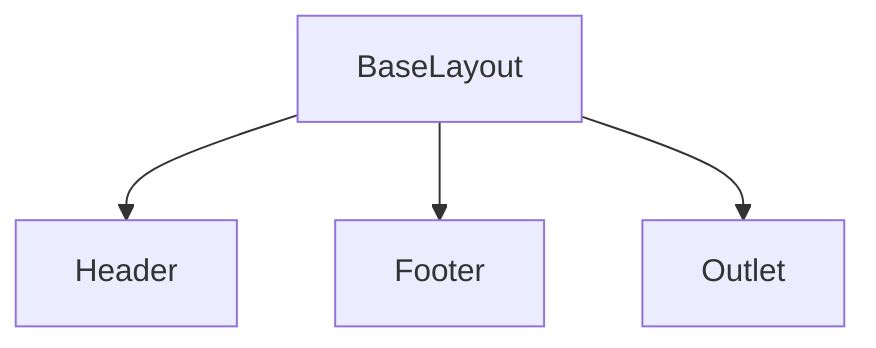
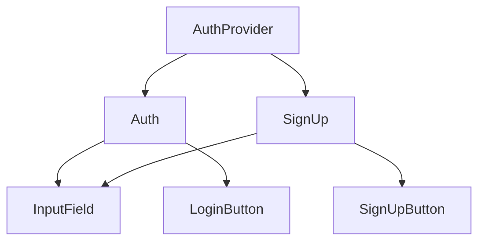
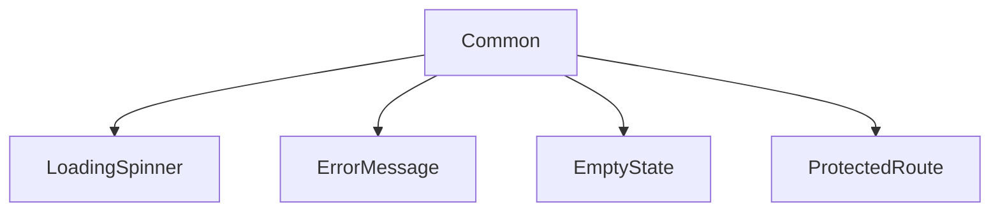
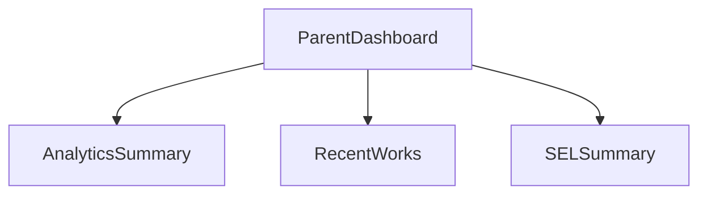
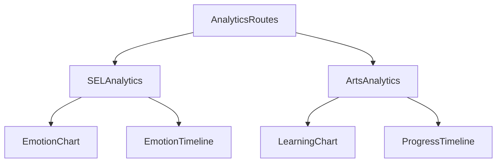
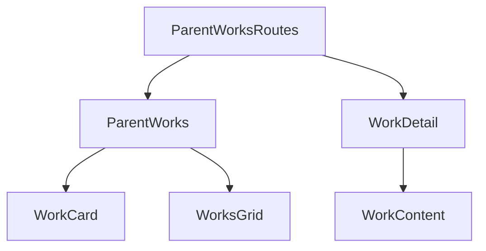
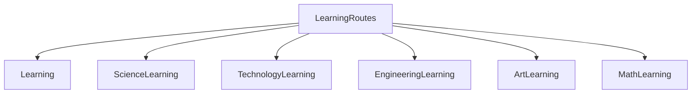
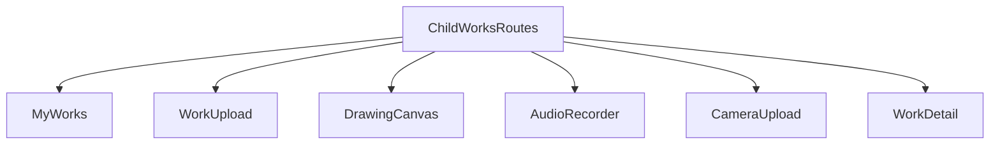
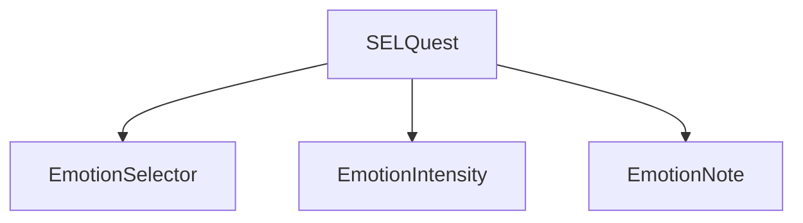

# コンポーネント設計

## 共通コンポーネント

### レイアウト

### 認証関連

### 共通UI

## 保護者向けコンポーネント

### ダッシュボード

### 分析

### 作品管理

## 子供向けコンポーネント

### 学習

### 作品作成

### きもちクエスト

## コンポーネント一覧

### 共通コンポーネント
- `BaseLayout` - 基本レイアウト
- `Header` - ヘッダー
- `Footer` - フッター
- `LoadingSpinner` - ローディング表示
- `ErrorMessage` - エラーメッセージ
- `EmptyState` - 空の状態表示
- `ProtectedRoute` - 認証保護ルート

### 認証コンポーネント
- `AuthProvider` - 認証状態管理
- `Auth` - ログインフォーム
- `SignUp` - 新規登録フォーム
- `InputField` - 入力フィールド
- `LoginButton` - ログインボタン
- `SignUpButton` - 新規登録ボタン

### 保護者向けコンポーネント
- `ParentLayout` - 保護者用レイアウト
- `ParentDashboard` - ダッシュボード
- `SELAnalytics` - 感情分析
- `ArtsAnalytics` - 学習分析
- `ParentWorks` - 作品一覧
- `WorkDetail` - 作品詳細

### 子供向けコンポーネント
- `ChildLayout` - 子供用レイアウト
- `Home` - ホーム画面
- `Learning` - 学習トップ
- `MyWorks` - 作品一覧
- `WorkUpload` - 作品アップロード
- `DrawingCanvas` - お絵かき
- `AudioRecorder` - 音声録音
- `CameraUpload` - 写真撮影
- `SELQuest` - きもちクエスト

## コンポーネント設計方針

### 1. 責務の分離
- Presentational Components（見た目）とContainer Components（ロジック）の分離
- 共通UIコンポーネントの再利用

### 2. パフォーマンス最適化
- `React.memo`による不要な再レンダリングの防止
- 適切なコンポーネントの分割
- Suspenseによる遅延ローディング

### 3. エラーハンドリング
- エラー境界の適切な配置
- ユーザーフレンドリーなエラーメッセージ
- リトライ機能の実装

### 4. アクセシビリティ
- WAI-ARIAの適切な使用
- キーボード操作のサポート
- スクリーンリーダー対応

### 5. 状態管理
- コンポーネントローカルな状態はuseState
- 共有が必要な状態はコンテキスト
- 複雑な状態管理はカスタムフック 