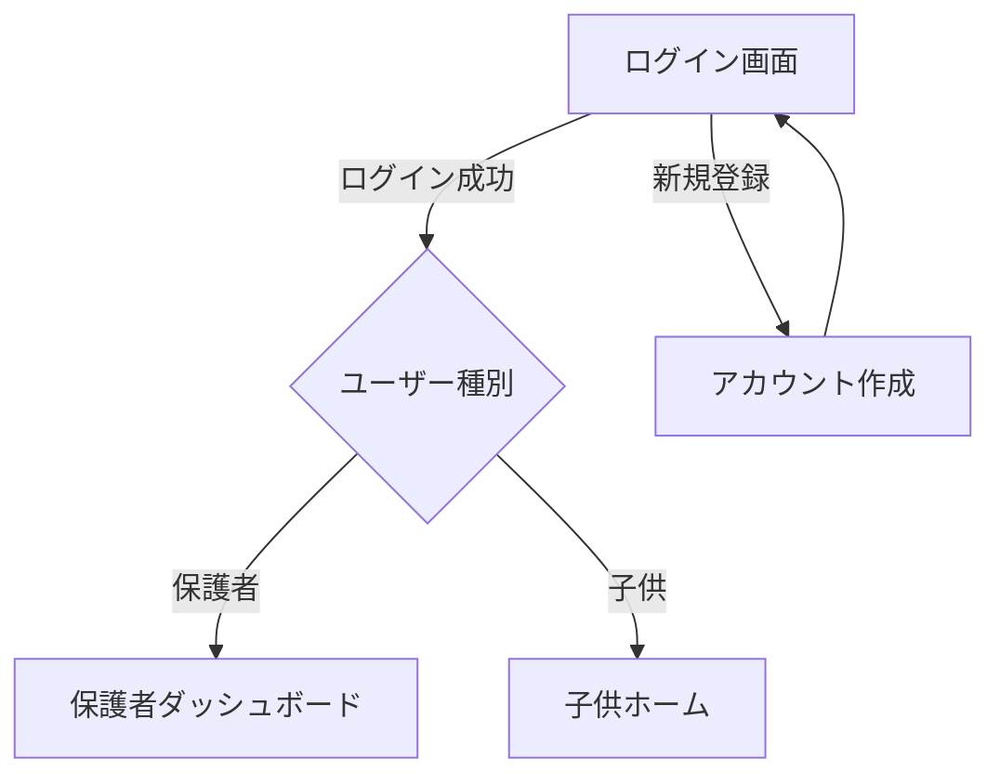
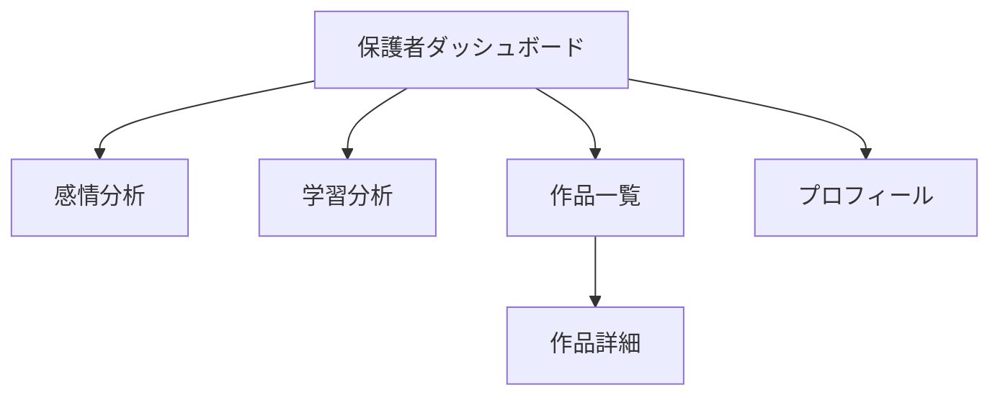

# 画面遷移図

## 認証フロー


## 保護者向け画面


## 子供向け画面
```mermaid
flowchart TD
    A[ホーム] --> B[学習]
    A --> C[作品投稿]
    A --> D[作品一覧]
    A --> E[きもち]
    
    B --> F[理科]
    B --> G[技術]
    B --> H[工学]
    B --> I[芸術]
    B --> J[数学]
    
    C --> K[描画]
    C --> L[音声]
    C --> M[写真]
    
    D --> N[作品詳細]
</mermaid>

## 画面一覧

### 共通
- `/auth/login` - ログイン画面
- `/auth/signup` - アカウント作成画面

### 保護者向け
- `/parent/dashboard` - ダッシュボード
- `/parent/analytics/sel` - 感情分析
- `/parent/analytics/arts` - 学習分析
- `/parent/works` - 作品一覧
- `/parent/works/:workId` - 作品詳細
- `/parent/profile` - プロフィール

### 子供向け
- `/child/home` - ホーム
- `/child/learning` - 学習トップ
- `/child/learning/science` - 理科
- `/child/learning/technology` - 技術
- `/child/learning/engineering` - 工学
- `/child/learning/art` - 芸術
- `/child/learning/math` - 数学
- `/child/works/new` - 作品投稿
- `/child/works/drawing` - 描画
- `/child/works/audio` - 音声録音
- `/child/works/camera` - 写真撮影
- `/child/works` - 作品一覧
- `/child/works/:workId` - 作品詳細
- `/child/sel-quest` - きもちクエスト 